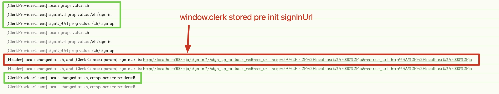

## Locale Switch Issue: `SignInButton` with `next-intl` (`localePrefix: "always"`)

### Description

When integrating `@clerk/nextjs` authentication and `next-intl` internationalization in a Next.js project (with `localePrefix: "always"` in `middleware.ts`), clicking the `<SignInButton />` to navigate to a custom sign-in page may result in the URL's locale prefix (e.g., `fr`) being incorrectly replaced by the default locale prefix (e.g., `en`).

### Steps to Reproduce

1. **Project Setup**
   - Initialize a Next.js (App Router) project.
   - Integrate `@clerk/nextjs` as per official documentation.
   - Configure `next-intl` with `middleware.ts` (`locales: ['en', 'zh', 'fr', 'jp']`, `defaultLocale: 'en'`, `localePrefix: "always"`).
   - Use `<SignInButton />` to navigate to a custom sign-in page (e.g., `app/[locale]/sign-in/[[...sign-in]]/page.tsx` rendering `<SignIn />`).
   - Configure sign-in related URLs (e.g., `signInUrl`) for `ClerkProvider` in `src/[locale]/layout.tsx`, managed via local environment variables (`.env.local`).
   - Add logging at `ClerkProvider` and `SignInButton` to observe locale handling.

2. **Switch to a Non-Default Locale**
   - Start the app; the homepage defaults to `en` (`http://localhost:3000/en`).
   - Switch the language (e.g., to `fr`); the URL updates to `http://localhost:3000/fr` and the page displays in French.

3. **Click the Sign-In Button**
   - Click `<SignInButton />`. The URL changes to `http://localhost:3000/en/sign-up?...&redirect_url=http://localhost:3000/fr`.
   - The sign-in page uses the wrong locale prefix (`/en/sign-up`), displaying the interface in English instead of French.

4. **Special Case**
   - If you **`manually refresh`** the page after switching the language, then click the sign-in button, the URL and interface use the correct locale (e.g., `http://localhost:3000/fr/sign-in?...`).
   - The Clerk sign-in card itself updates its language according to the locale, as long as the initial URL is correct.

5. **Conclusion**
   - The sign-in URLs configured in `ClerkProvider` correctly receive the current locale, but only after a page refresh.
   - The issue likely lies in `ClerkProvider` or `SignInButton` not updating promptly when the locale changes client-side, possibly due to caching or context synchronization issues.
   - Adding `key={locale}` to `ClerkProvider` and `SignInButton` to force re-rendering does not resolve the issue.

### Additional Findings

- Commenting out the sign-in/sign-up URL configuration does not resolve the issue.
- Logs show Clerk fetches configuration from the Dashboard. Testing reveals:
  - Code-level `signInUrl` in `ClerkProvider` has the highest priority,
  - Followed by the `NEXT_PUBLIC_CLERK_SIGN_IN_URL` environment variable,
  - Then the Clerk Dashboard configuration.

### Conclusion & Suggestions

- The root cause is that `ClerkProvider` parameters in `[locale]/layout.tsx` are not updated in time after switching locales, causing URLs to use the previous locale.
- Understanding how `ClerkProvider` manages these parameters (e.g., caching) may help locate and fix the issue.
- A current workaround: use `<SignInButton mode="modal">` for modal-based sign-in, which avoids the issue but may not be ideal.

## Source Code Investigation & Analysis
Based on source version `@clerk/nextjs@6.19.4`, [Clerk official release](https://github.com/clerk/javascript/releases/tag/%40clerk%2Fnextjs%406.19.4)

### 1. Root Cause

Through in-depth analysis of the `ClerkProvider`, `SignInButton`, and Clerk SDK source code, combined with actual debugging and log output, it is **ultimately confirmed that the root cause lies in the Clerk JS SDK (`window.Clerk`) being a global singleton on the client side**:

- `ClerkProvider` (regardless of prop changes) only initializes the window.Clerk instance once on the client.
- **`window.Clerk` is a global singleton**; as long as the page is not refreshed, all sign-in related configurations (such as signInUrl, signUpUrl, localization, etc.) will not update in response to React context or prop changes.
- This means that even if the locale changes, new URLs passed to ClerkProvider will not take effect, and SignInButton will still use the old URL.
- Only after a hard page refresh (F5 or window.location.href navigation) will window.Clerk re-initialize, and the new locale and URL configuration take effect.

### 2. Key Source Code Chain

- The React SDK (`@clerk/clerk-react`) manages the clerk-js instance via an IsomorphicClerk singleton.
- clerk-js (`@clerk/clerk-js`) mounts the instance to window.Clerk in the browser environment, and only does so once.
- Sign-in URLs, localization, and other config parameters are stored in `window.Clerk.__unstable__options`.
- You can check the current sign-in URL config in the browser console via `window.Clerk.buildSignInUrl()`, or log it server-side via `useClerk().buildSignInUrl()`.

### 3. Practical Testing & Verification

- Logs show: after switching locale, ClerkProvider props are updated and the component re-renders, but the URL in `window.Clerk` remains the old one (e.g., `/ja/sign-in`).
- Only after refreshing the page does `window.Clerk` initialize with the new locale, and the URL becomes `/zh/sign-in`.
- See the following test screenshot; the red box shows window.Clerk still holding the old locale's URL.

### 4. Debugging & Verification Methods

- Pay attention to console output to check the currently effective sign-in URL and localization config.
- After switching locale without refreshing, the URL does not change; after refreshing, the URL is correct.

### 5. Conclusion & Suggestions

- **Essential cause: `window.Clerk` is a global singleton; props/context changes do not trigger SDK re-initialization**
- Short-term workaround: force a page refresh when switching locale, or use modal sign-in (`mode="modal"`) to temporarily bypass the issue
- Long-term solution: wait for official fix from Clerk
- Degraded solution: if acceptable, always redirect to the default language sign-in page and let users manually switch language
