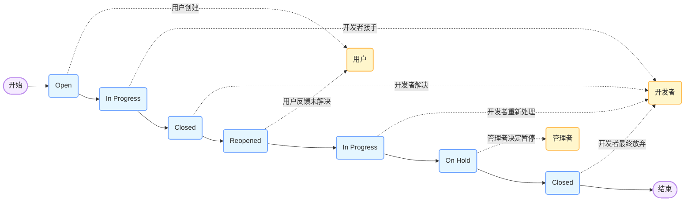
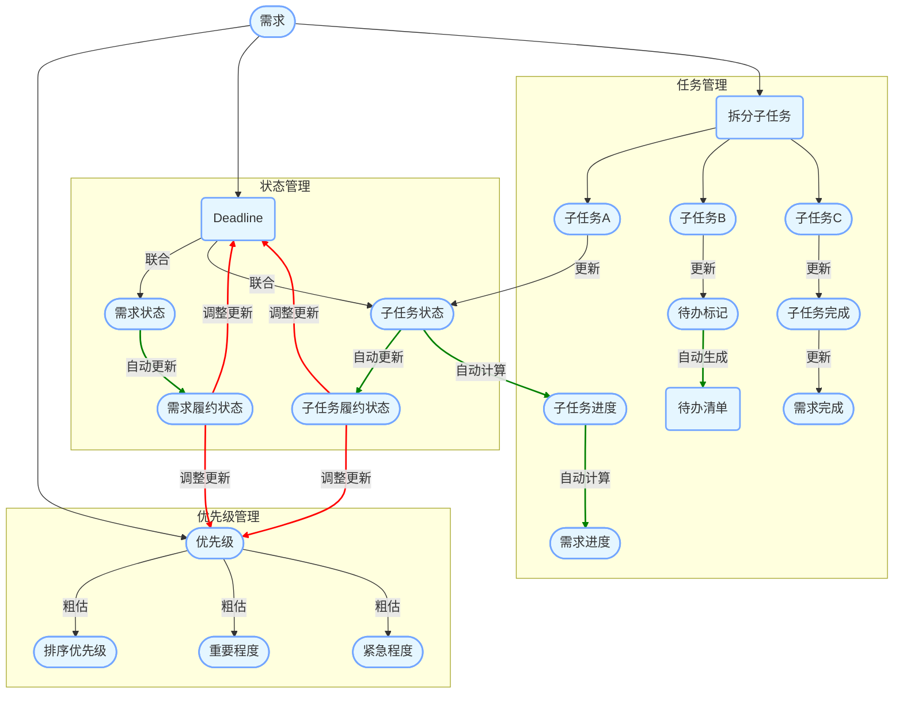

```mermaid
graph LR
    classDef startend fill:#F5EBFF,stroke:#BE8FED,stroke-width:2px;
    classDef process fill:#E5F6FF,stroke:#73A6FF,stroke-width:2px;
    classDef decision fill:#FFF6CC,stroke:#FFBC52,stroke-width:2px;
    
    A([开始]):::startend --> B(Open):::process
    B -.->|用户创建| U1(用户):::decision
    B --> C(In Progress):::process
    C -.->|开发者接手| U2(开发者):::decision
    C --> D(Closed):::process
    D -.->|开发者解决| U2
    D --> E(Reopened):::process
    E -.->|用户反馈未解决| U1
    E --> F(In Progress):::process
    F -.->|开发者重新处理| U2
    F --> G(On Hold):::process
    G -.->|管理者决定暂停| U3(管理者):::decision
    G --> H(Closed):::process
    H -.->|开发者最终放弃| U2
    H --> I([结束]):::startend       
``` 

```mermaid
flowchart TB
    classDef process fill:#E5F6FF,stroke:#73A6FF,stroke-width:2px;
    
    R([需求]):::process
    P([优先级]):::process
    D(Deadline):::process
    Sub(拆分子任务):::process
    
    PS([排序优先级]):::process
    PI([重要程度]):::process
    PT([紧急程度]):::process
    
    S1([子任务A]):::process
    S2([子任务B]):::process
    S3([子任务C]):::process
    
    SS([子任务状态]):::process
    SP([子任务进度]):::process
    RP([需求进度]):::process
    
    FLAG([待办标记]):::process
    TODO(待办清单):::process
    
    SSE([子任务完成]):::process
    RSE([需求完成]):::process
    
    RS([需求状态]):::process
    
    CPS([子任务履约状态]):::process
    CPR([需求履约状态]):::process
    
    R --> P
    R --> D
    R --> Sub
    
    subgraph 优先级管理
        direction LR
        P -->|粗估| PS & PI & PT
    end
    
    subgraph 状态管理
        direction TB
        D -->|联合| RS
        D -->|联合| SS
        
        RS -->|自动更新| CPR
        SS -->|自动更新| CPS
    end
    
    subgraph 任务管理
        direction TB
        Sub --> S1 & S2 & S3
        
        S1 -->|更新| SS
        S2 -->|更新| FLAG
        S3 -->|更新| SSE
        
        SS -->|自动计算| SP
        FLAG -->|自动生成| TODO
        SSE -->|更新| RSE
        
        SP -->|自动计算| RP
    end
    
    CPR -->|调整更新| P
    CPR -->|调整更新| D
    CPS -->|调整更新| P
    CPS -->|调整更新| D
    
    linkStyle 8 stroke:green,stroke-width:2px
    linkStyle 9 stroke:green,stroke-width:2px
    linkStyle 16 stroke:green,stroke-width:2px
    linkStyle 17 stroke:green,stroke-width:2px
    linkStyle 19 stroke:green,stroke-width:2px

    linkStyle 20 stroke:red,stroke-width:2px
    linkStyle 21 stroke:red,stroke-width:2px
    linkStyle 22 stroke:red,stroke-width:2px
    linkStyle 23 stroke:red,stroke-width:2px

```